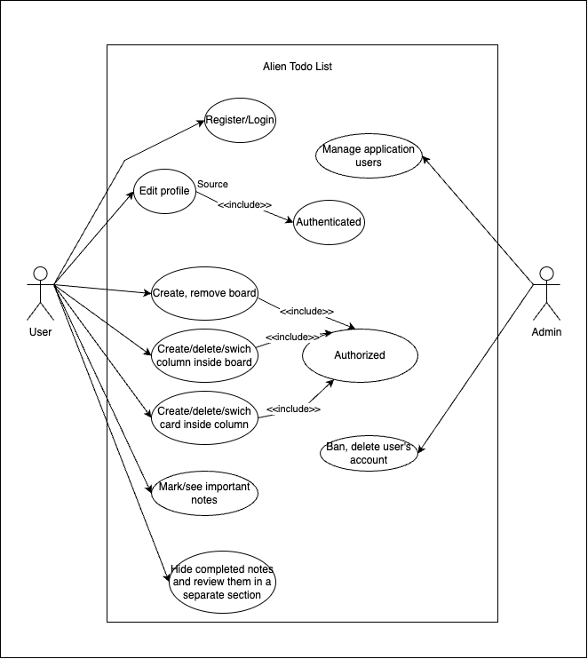
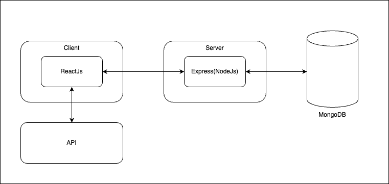
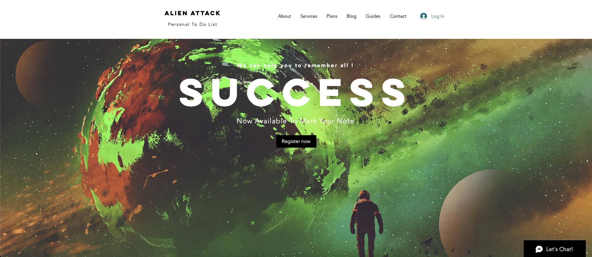
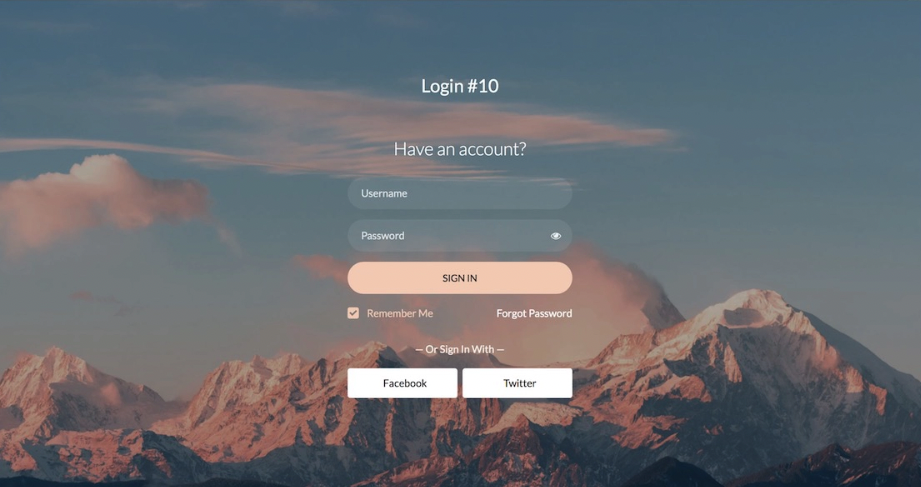
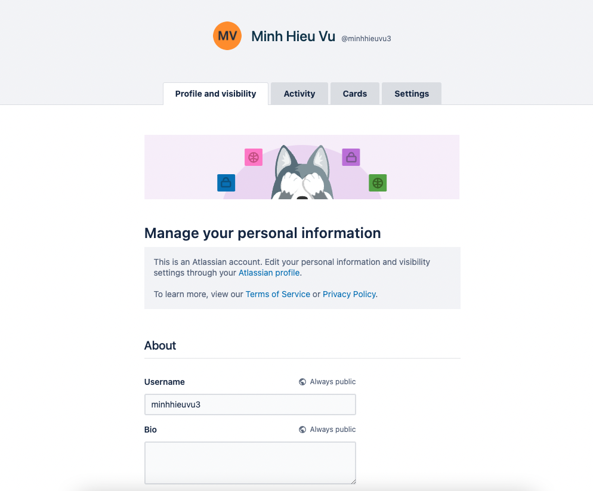

# ALien ToDo List

## Contributor

-   [@hieuminhvuu](https://www.github.com/hieuminhvuu)
-   [@Maybenex1ime](https://github.com/Maybenex1ime)

## Description

**_WE UNDERSTAND YOU !  _**
In our hasty lives, we are always busy with many things. At school, we are chased by deadlines; when we go to work, our boss scolds us for too much work; and then being sulked by a lover for missing an appointment, forgetting important anniversaries...
Don't worry, we will help you! We are Alien - TodoList ! With a simple, easy-to-use interface, but full of utilities, we will always be your emotional support, a place you can trust to store things to remember.

## Technologies

-   [ReactJS] - JS library for frontend development
-   [NodeJS] - evened I/O for the backend
-   [ExpressJS] - fast node.js network app framework, manages the website’s backend functionality and structure.
-   [MongoDB] - A platform providing a fully managed database service, with monitoring, backups and migration tools.

####

-   Front-end
    -   Framework: React
    -   CSS
        -   Preprocessor: Sass

## Resource

Google font: https://fonts.google.com/
Boxicons: https://boxicons.com/
Images: https://unsplash.com/

## Features

-   Register new user
-   Admin CRUD operations

## Usecase

## Client Server Architecture

## Demo

> Sketch on internet

### Website

### Register - Login

### Home Page

### Main Board Task

## License

[MIT](https://choosealicense.com/licenses/mit/)

## Contact

hieuminhvuu@gmail.com
